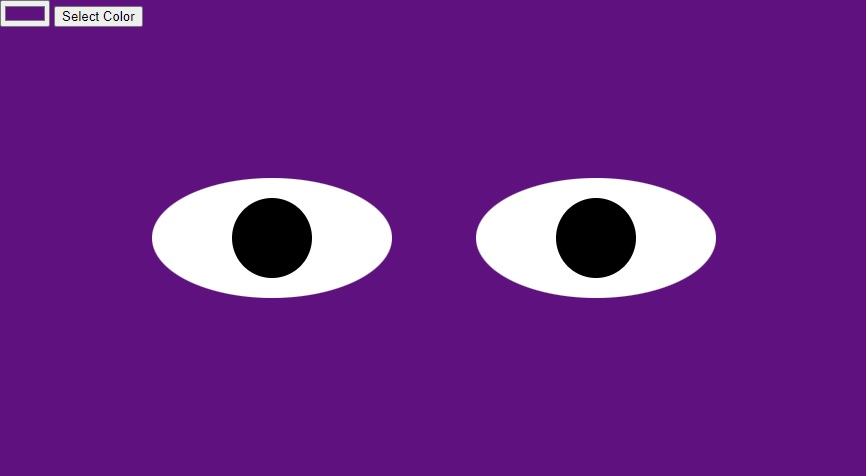

<div align="center" id="top"> 
  

  &#xa0;

  <!-- <a href="https://eyes.netlify.app">Demo</a> -->
</div>

<h1 align="center">Eyes</h1>

<p align="center">
  

  

  

  

  <!--  -->

  <!--  -->

  <!--  -->
</p>

<!-- Status -->

<!-- <h4 align="center"> 
	🚧  Eyes 🚀 Under construction...  🚧
</h4> 

<hr> -->

<p align="center">
  <a href="#dart-about">About</a> &#xa0; | &#xa0; 
  <a href="#rocket-Languages">Languages</a> &#xa0; | &#xa0;
  <a href="#white_check_mark-requirements">Requirements</a> &#xa0; | &#xa0;
  <a href="#checkered_flag-starting">Starting</a> &#xa0; | &#xa0;
  <a href="#memo-license">License</a> &#xa0; | &#xa0;
  <a href="https://github.com/gibranalcazar" target="_blank">Author</a>
</p>

<br>

## :dart: About ##

This is a web application for testing mouse related events; in this case two objects are simulating eyes and they will move according to the mouse position.

## :sparkles: Try it! ##

<a href="https://gibranalcazar.github.io/Eyes/" target="_blank">Link To Eye's App</a>


## :rocket: Languages ##


- JavaScript
- HTML
- CSS


## :white_check_mark: Requirements ##

Before starting :checkered_flag:, you need to have [Git](https://git-scm.com) installed.

## :checkered_flag: Starting ##

```bash
# Clone this project
$ git clone https://github.com/gibranalcazar/eyes

# Access
$ cd eyes

```

## :memo: License ##

This project is under license from MIT. For more details, see the [LICENSE](LICENSE) file.


Made with :heart: by <a href="https://github.com/gibranalcazar" target="_blank">Gibrán Alcázar</a>

&#xa0;

<a href="#top">Back to top</a>
